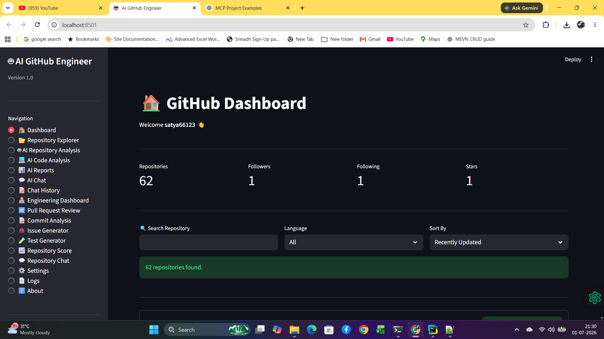
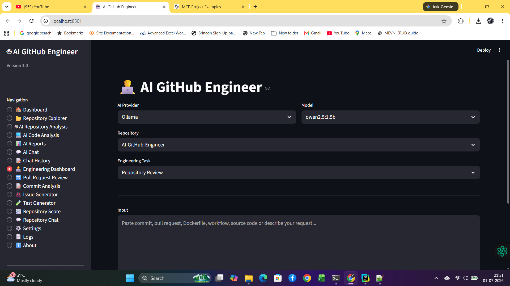
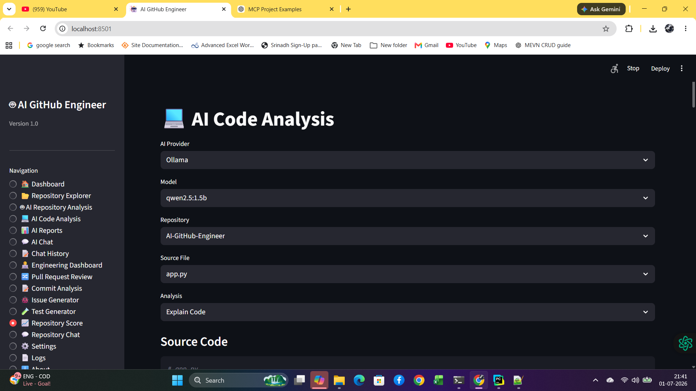
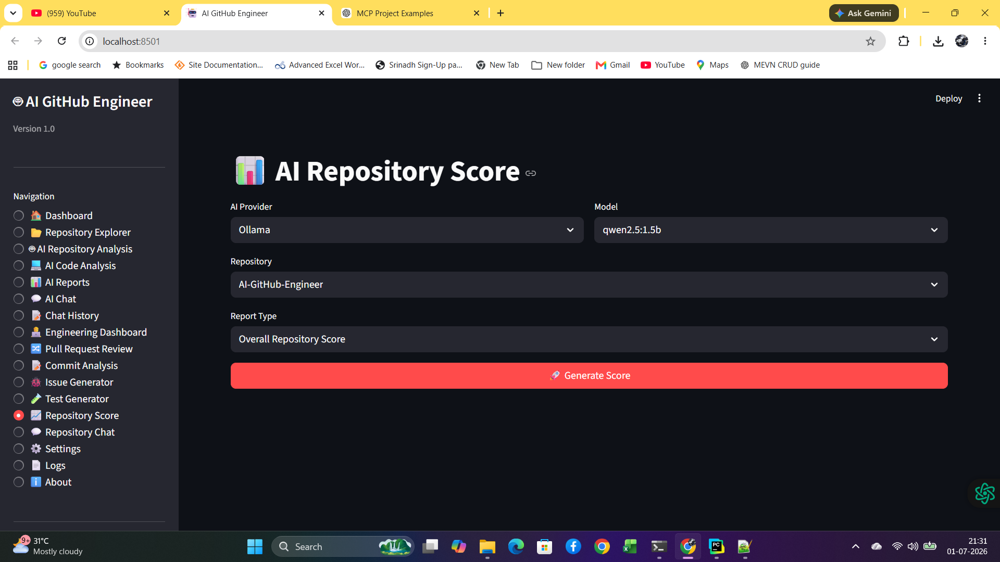
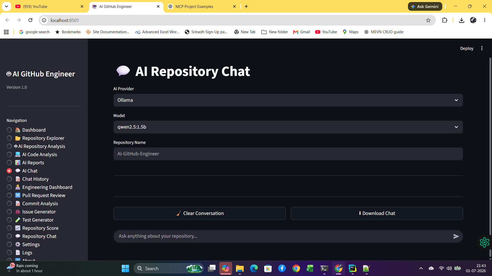
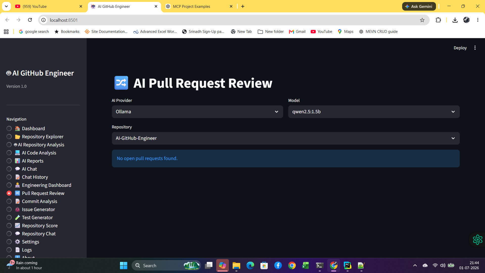

# 🤖 AI GitHub Engineer


---

# 🚀 Overview

**AI GitHub Engineer** is a production-style AI software engineering platform that combines **GitHub REST API**, **OpenAI**, **Ollama**, and **Streamlit** to analyze repositories, review code, generate documentation, perform security analysis, review pull requests, analyze commits, generate tests, and assist developers with AI-powered software engineering workflows.

The project demonstrates modern AI application architecture with support for both **cloud LLMs** and **local LLMs**.

---

# ✨ Features

## 📂 GitHub Integration

* GitHub Authentication
* User Profile
* Repository Explorer
* Branch Explorer
* Commit Explorer
* Contributor Analysis
* Repository Statistics

---

## 🤖 AI Providers

* OpenAI
* Ollama
* Multi-Provider Architecture
* Multiple Model Selection
* Local & Cloud AI Support

---

## 📊 Repository Analysis

* Repository Summary
* Architecture Review
* README Analysis
* Dependency Analysis
* Repository Health Report
* Repository Scoring
* Improvement Suggestions

---

## 💻 AI Code Analysis

* Explain Code
* Code Review
* Complexity Analysis
* Bug Detection
* Security Review
* Documentation Generator
* Refactoring Suggestions

---

## 👨‍💻 AI GitHub Engineering

* Pull Request Review
* Commit Analysis
* Issue Generator
* Test Generator
* Changelog Generator
* Workflow Analyzer
* Docker Analyzer
* License Analyzer
* Repository Chat
* Engineering Dashboard
* Project Generator

---

## 📄 Reports

* Repository Report
* Architecture Report
* Security Report
* Health Report
* Markdown Export

---

## 💬 AI Chat

* AI Chat
* Repository Chat
* Chat History
* Download Responses

---

# 🏗 Architecture

```text
                GitHub REST API
                       │
             Repository Information
                       │
         ┌─────────────▼─────────────┐
         │     AI GitHub Engineer    │
         └─────────────┬─────────────┘
                       │
        ┌──────────────┼──────────────┐
        │                             │
     OpenAI                      Ollama
        │                             │
        └──────────────┬──────────────┘
                       │
            AI Engineering Modules
                       │
        Streamlit Professional UI
```

---

# 🛠 Technology Stack

### Backend

* Python 3.11+
* GitHub REST API
* Requests

### AI

* OpenAI
* Ollama

### Frontend

* Streamlit

### Version Control

* Git
* GitHub

---

# 📁 Project Structure

```text
AI-GitHub-Engineer/

app.py

config/

history/

logs/

exports/

src/

    ai/

    api/

    config/

    ui/

    utils/
```

---

# ⚙ Installation

```bash
git clone https://github.com/satya66123/AI-GitHub-Engineer.git

cd AI-GitHub-Engineer

pip install -r requirements.txt

streamlit run app.py
```

---

# 🔐 Environment Variables

```env
GITHUB_TOKEN=

OPENAI_API_KEY=

DEFAULT_PROVIDER=Ollama

DEFAULT_OLLAMA_MODEL=qwen2.5:1.5b

OLLAMA_URL=http://localhost:11434/api/generate
```

---

# 📸 Screenshots

Add screenshots of:

## Dashboard



## Repository Analysis


## Engineering Dashboard



## AI Code Analysis



## Repository Score



## AI Chat



## Pull Request Review



---

# 📈 Project Timeline

| Phase                                     | Status   |
| ----------------------------------------- | -------- |
| ✅ Phase 1 – GitHub API Foundation         | Complete |
| ✅ Phase 2 – Repository Dashboard          | Complete |
| ✅ Phase 3 – AI Repository & Code Analysis | Complete |
| ✅ Phase 4 – AI GitHub Engineering         | Complete |

---

# 🎯 Highlights

* Modular Architecture
* Multi-Provider AI
* GitHub REST API Integration
* Local LLM Support
* Cloud LLM Support
* Production-Oriented Design
* AI Software Engineering Toolkit
* Professional Streamlit UI

---

# 🚀 Future Improvements

Although **v1.0.0** is complete, future enhancements may include:

* MCP (Model Context Protocol) integration
* Semantic repository search (RAG)
* Vector database support
* Multi-agent collaboration
* GitHub Actions automation
* Automatic pull request creation
* Automatic issue creation in GitHub
* AI code generation from requirements
* Repository dependency visualization
* Architecture diagrams with Mermaid
* Team collaboration features
* Plugin architecture
* Enterprise authentication
* Code ownership analysis
* Repository trend analytics

---

# 📊 Project Status

| Item             | Status     |
| ---------------- | ---------- |
| Version          | ✅ v1.0.0   |
| Core Features    | ✅ Complete |
| Production Ready | ✅ Yes      |
| Portfolio Ready  | ✅ Yes      |
| Interview Ready  | ✅ Yes      |
| Stable Release   | ✅ Yes      |

---

# 🤝 Contributing

Contributions, suggestions, and improvements are welcome.

If you find a bug or have an enhancement idea, feel free to open an Issue or submit a Pull Request.

---

# ⭐ Support

If you found this project helpful, please consider giving it a **⭐ Star** on GitHub.

---

# 👨‍💻 Author

**Satya Srinath Nekkanti**

GitHub: https://github.com/satya66123

LinkedIn: https://www.linkedin.com/in/satya-srinath-nekkanti-08b012a3/

---

# 📄 License

This project is licensed under the **MIT License**.

---

## 🎉 Project Complete


**⭐ AI GitHub Engineer — An AI-Powered Software Engineering Platform ⭐**


